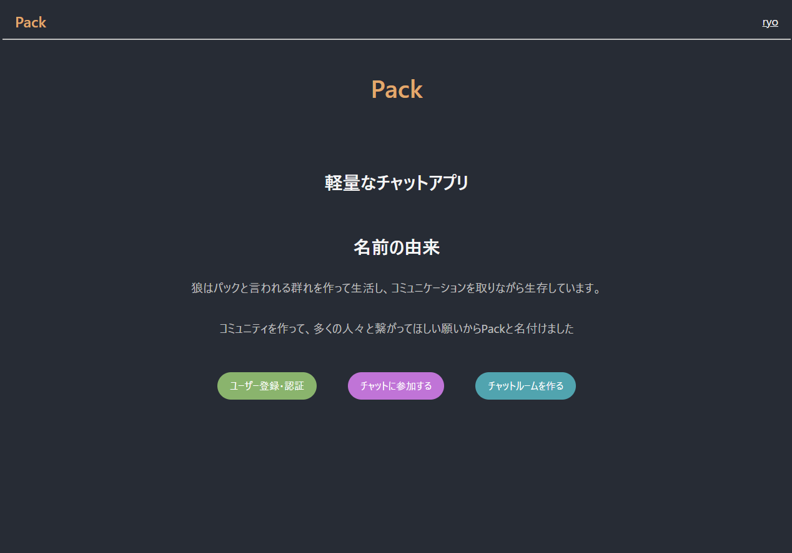
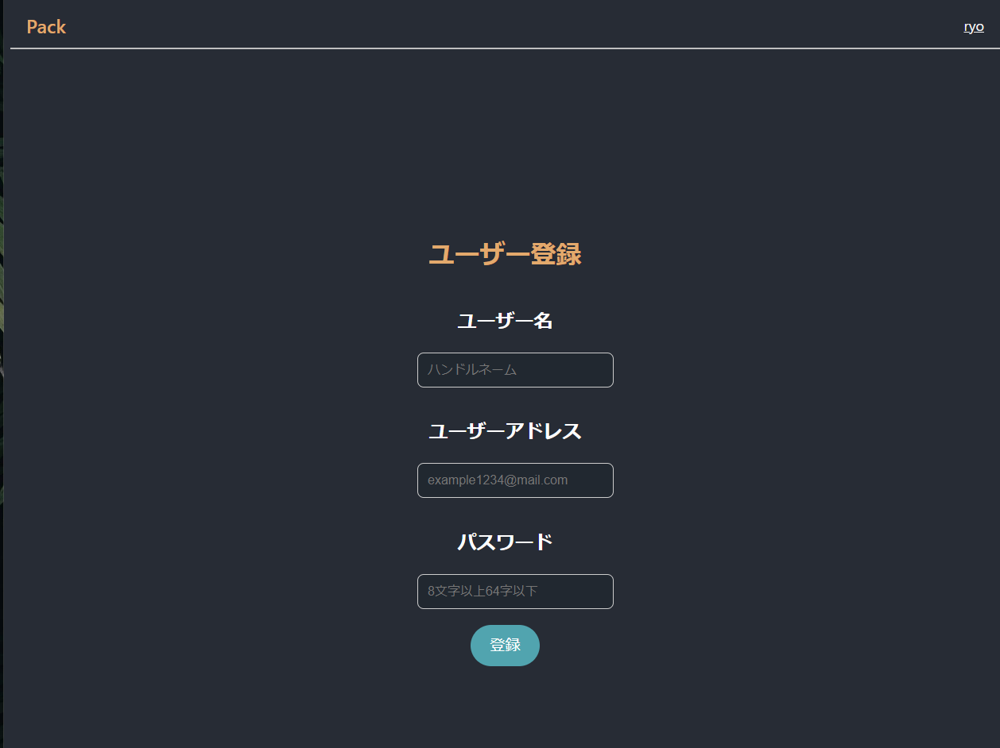
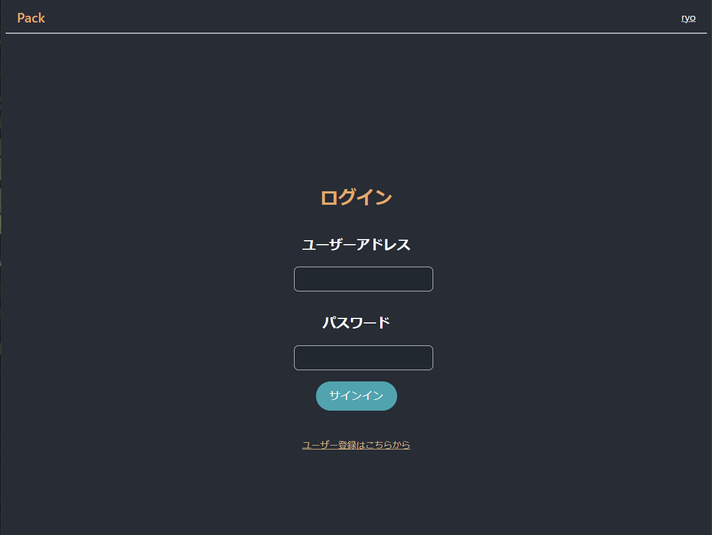
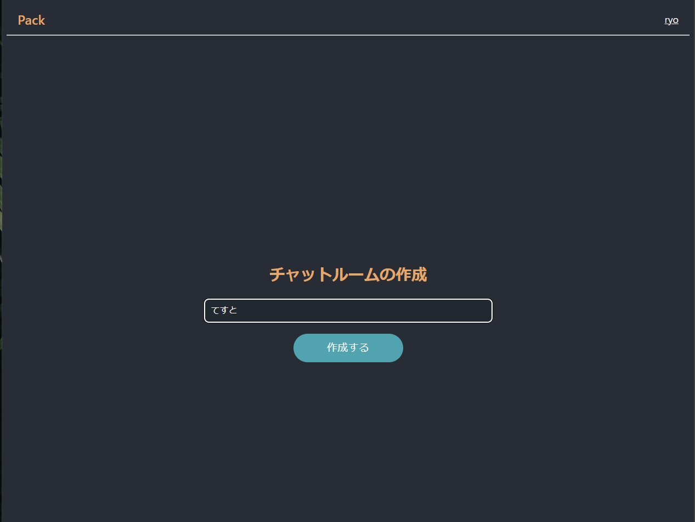
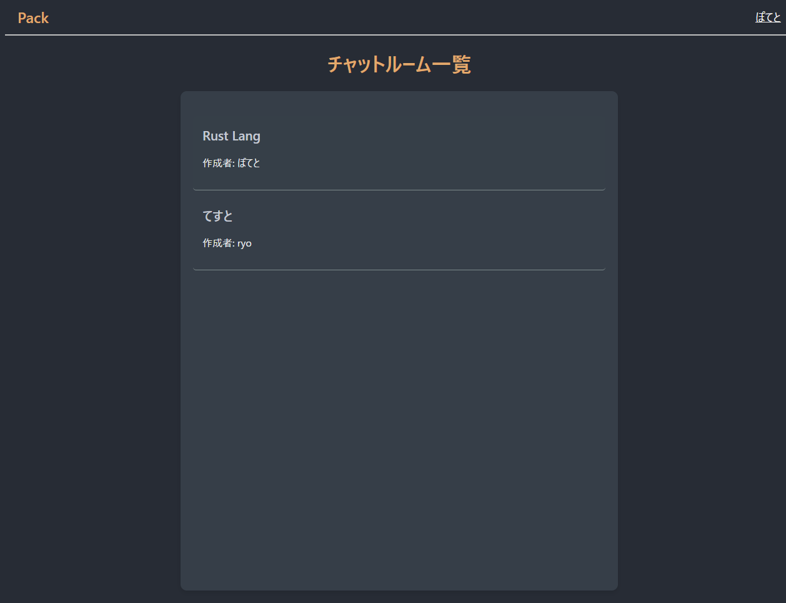
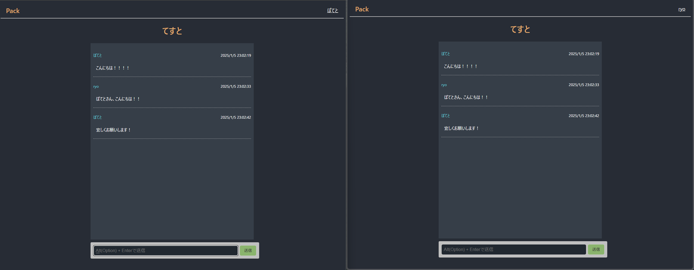

# chat-app-server
## Overview
Rustで書かれた軽量かつシンプルなオープンソースのチャット機能を提供するWeb APIです。  
WebSocketを使用し、リアルタイムチャットを実現します。最小限の機能で動作し、拡張が容易です。  
## Features
- 軽量で高速なチャット機能
- WebSocketを使用したリアルタイム通信
- シンプルなAPI設計
- JWTを使用した認証
## Run Server
### Prerequisites
以下のソフトウェアが必要です:
- [Docker](https://www.docker.com/)
### Installation And Run
1. リポジトリをクローンします:
    ```bash
    git clone https://github.com/nakaryo716/chat-app-server
    cd chat-app-server
    ```
2. ```.env```ファイルのALLOW_ORIGINのIPアドレスを自身のコンピュータのIPアドレスに修正してください
    ```
    ALLOW_ORIGIN=https://192.168.0.1
    ```
3. Dockerコンテナを立ち上げます:  
    ```bash
    docker compose up
    ```
4. app, dbコンテナが起動し、APIが使用可能になります
    ```
    container name: port
    ------------------------
    app           : 8080
    db            : 15432
    ```
## Sample Client Application








このAPIとnextjsを使った実際のアプリケーションは以下のリポジトリから取得し、実行することができます。  
Nginxを使用してリバースプロキシでTLS通信を行い、クライアントとサーバーでクロスオリジンリソースシェアリングを行います

実行方法については(https://github.com/nakaryo716/chat-app-proxy-example)の```アプリケーションの全体の実行```を参照してください

## API Endpoints
### ユーザー登録
Method: ```POST```  
URL: ```https://localhost:1443/user```  
Request Body:
```json
{
    "userName": "your user name",
    "userMail": "yourmail@mail.com",
    "userPass": "youruserpass"
}
```
### ログイン
Method: ```POST```  
URL: ```https://localhost:1443/login```  
Request Body:
```json
{
    "userMail": "yourmail@mail.com",
    "userPass": "youruserpass"
}
```
**CookieにJWTが保存される**  
### ユーザー情報取得
Method: ```GET```  
URL: ```https://localhost:1443/user```  
Auth: JWTが有効である必要がある
### ユーザー削除
Method: ```DELETE```  
URL: ```https://localhost:1443/user```   
Auth: JWTが有効である必要がある  
Request Body:
```json
{
    "userMail": "yourmail@mail.com",
    "userPass": "youruserpass"
}
```
### チャットルーム作成
Method: ```POST```  
URL: ```https://localhost:1443/room```  
Auth: JWTが有効である必要がある  
Request Body:
```json
{
    "roomName": "room name",
}
```
### 全てのチャットルーム情報取得
Method: ```GET```  
URL: ```https://localhost:1443/room```  
Auth: JWTが有効である必要がある  
### 特定のチャットルーム情報取得
Method: ```GET```  
URL: ```https://localhost:1443/room/:id```  
Auth: JWTが有効である必要がある  
### チャットルームの削除
Method: ```DELETE```  
URL: ```https://localhost:1443/room/:id```  
Auth: JWTが有効である必要がある  
### チャット参加(WebSocket)
Method: ```GET```  
URL: ```wss://localhost:1443/chat/:id```  
Auth: JWTが有効である必要がある  
## License
This project is licensed under the MIT License - see the LICENSE file for details.

